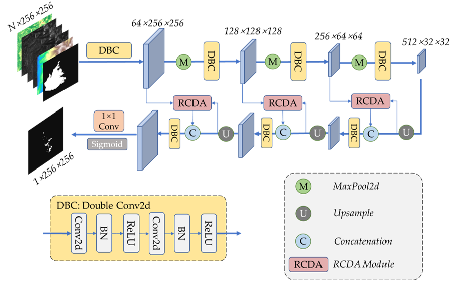
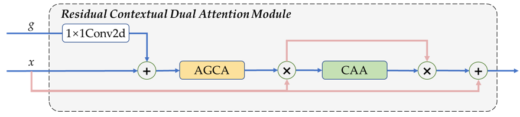
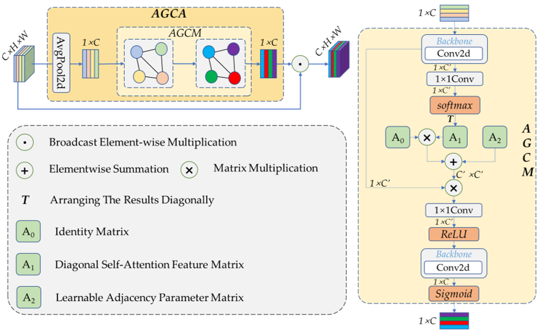
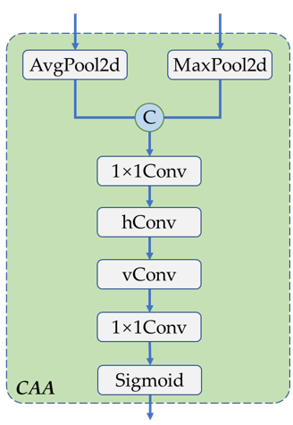
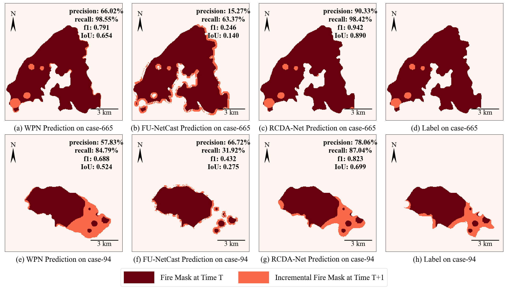

# RCDA-Net: A Residual Contextual Dual Attention Network for Wildfire Spread Region Prediction

This repository contains the implementation of RCDA-Net, a deep learning model designed for wildfire spread prediction using multi-source remote sensing data. The model integrates Residual Contextual Dual Attention (RCDA) mechanisms to enhance semantic segmentation of incremental wildfire regions. This project is developed by researchers from Wuhan University, China.



**Figure. RCDA-Net Architecture Diagram. In the figure, N represents Number of Input Modalities.**



**Figure. Architecture of the RCDA Module Integrating AGCA and CAA Attention Mechanisms.**



**Figure. Architecture of the Adaptive Graph Channel Attention (AGCA) Module.**



**Figure. Architecture of the Context Anchor Attention (CAA) Module. hConv denotes a hori-zontal depthwise convolution with kernel size (1×h), and vConv denotes a vertical depthwise convolution with kernel size (v×1).**

## Installation

To create a python environment with all the dependencies, run the following command:(Taking Anaconda or Miniconda as examples)

```bash
conda create -n rcda python=3.13
conda activate rcda
pip install -r requirements.txt
```

## Dataset For Wildfire Prediction

This repository includes a partial dataset in the `dataset/` directory for testing purposes. The full dataset (2015–2019 wildfire data from Canada and Alaska) is not included due to size constraints. To train the model:

- Download the complete dataset from [Baidu Cloud](https://pan.baidu.com/s/1kyu-zRuw1Trk14cxBqe_jw) or [Google Drive](https://drive.google.com/file/d/17aAw3nSIsRm1VXRFQPPUqnwO-qStkiW2/view?usp=sharing).(The extraction code is 6666)
- Place the `inputs` and `labels` folders in the `train` and `test` subdirectories.

## Usage

### Training

Train the model using `train.py` with customizable arguments:

```bash
python train.py --model_name rcda --epochs 200 --loss_function DiceLoss
```

The optional parameters and their meanings are as follows:

- `--model_name`: Choose from `rcda`, `unet`, `attunet`, `rcda-5`, `cda`, `ragca`, `rca`, `resunet`, `wpn`, `fire_simulator`, `funetcast`, `r2u_net`, `r2att_u_net`, `asufm`.
- `--net_name`: Name of the network model. Mainly used for naming the folder where `tensorboard` logs are located.
- `--weight_save_name`: Model weights are saved to `weights/<weight_save_name>.pth`.
- `--limit_patience`: Maximum number of epochs with no improvement before early stopping. (default=30)
- `--learning_rate`: Learning rate for optimization. (default=0.001)
- `--batch_size`: Batch size for training. (default=8)
- `--num_workers`: Number of worker threads for data loading. (default=4)
- `--epochs`: Maximum number of training epochs. (default=200)
- `--loss_function`: Loss function type: `FocalLoss`, `DiceLoss`, `CombinedLoss`, or `BCELoss`. (default=`Focalloss`)
- `--focal_alpha`: Alpha parameter for Focal Loss. (default=0.75)
- `--focal_gamma`: Gamma parameter for Focal Loss. (default=2.0)
- `--dice_weight`: Weight of Dice Loss in Combined Loss. (default=0.5)

### Evaluation

Evaluate and visualize model performance using `eval.py`:

```bash
python eval.py --weight_name rcda wpn --model_name rcda wpn --threshold_list 0.5 0.6 --UID_list 665 94 --date_list 2016-07-05 2015-06-24 
```

The optional parameters and their meanings are as follows:

- `--model_name`: List of model architecture names (Choose from `rcda`, `unet`, `attunet`, `rcda-5`, `cda`, `ragca`, `rca`, `resunet`, `wpn`, `fire_simulator`, `funetcast`, `r2u_net`, `r2att_u_net`, `asufm`). 
- `--weight_name`: List of weight file names. (from `weights/<weight_name>.pth`)
- `--UID_list`: List of unique fire case IDs for case analysis. (default=[])
- `--date_list`:  List of fire occurrence dates for case analysis. (default=[])
- `--threshold_list`: List of initial prediction thresholds (as strings, e.g., 0.2 0.5 0.6) to evaluate. If provided, these values are used as starting thresholds. The list will be dynamically updated with the best threshold identified during evaluation. If not specified, the best threshold will be determined automatically and used. (default=[])
- `--data_type`: Dataset types used for case analysis. Choices are "train", "eval". (default="eval")

After successfully executing `eval.py`, a result graph similar to the one shown in the following figure will be generated in the current working directory. `Comparison-Fig.png`



#### Note

- Model name(`--model_name`) list and weight name(`--weight_name`) list must maintain consistent length and correspond one-to-one.
- UID_list and date_mast must maintain consistent length and correspond one-to-one, and it is necessary to ensure that the corresponding cases can be found in the `dataset/test`.

## References

The code is based on the following repositories, we thank the authors for their excellent contributions.

[Paying Attention to Wildfire: Using U-Net with Attention Blocks on Multimodal Data for Next Day Prediction.]()

[Wildfire Spread Prediction in North America Using Satellite Imagery and Vision Transformer. ](https://github.com/bronteee/fire-asufm?tab=readme-ov-file)

[A Spatio-Temporal Neural Network Forecasting Approach for Emulation of Firefront Models.](https://doi.org/10.23919/SPA53010.2022.9927888)

[Forest Fire Spread Prediction Using Deep Learning.](https://doi.org/10.1117/12.2585997)

## Citation

If you use this code or dataset, please cite: (in preparation)

> Huang, X.; Meng, Q.; Fu, J.; Zou, Q. RCDA-Net: A Residual Contextual Dual Attention Network for Wildfire Spread Region Prediction. *Remote Sensing* (in preparation).

## Contact

- **Xiaoxuan Huang**: huangxiaoxuan@whu.edu.cn  
- **Jianhong Fu**: fu_jianhong@whu.edu.cn  
- **Qin Zou**: qz@whu.edu.cn  
- **Qingxiang Meng** (Corresponding Author): mqx@whu.edu.cn; 
  Affiliation: Wuhan University, Wuhan 430072, Hubei, China

## License

This project is released under the MIT License. See the `LICENSE` file for details.